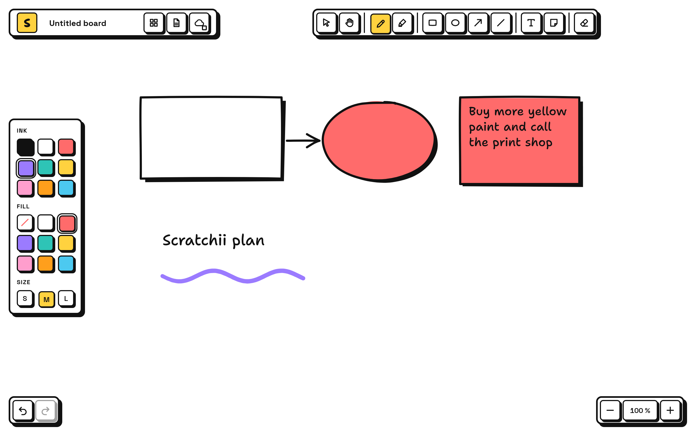
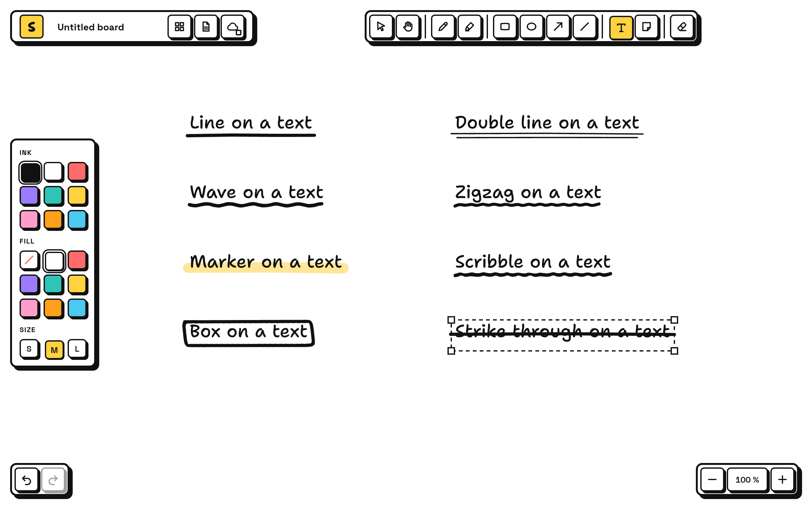
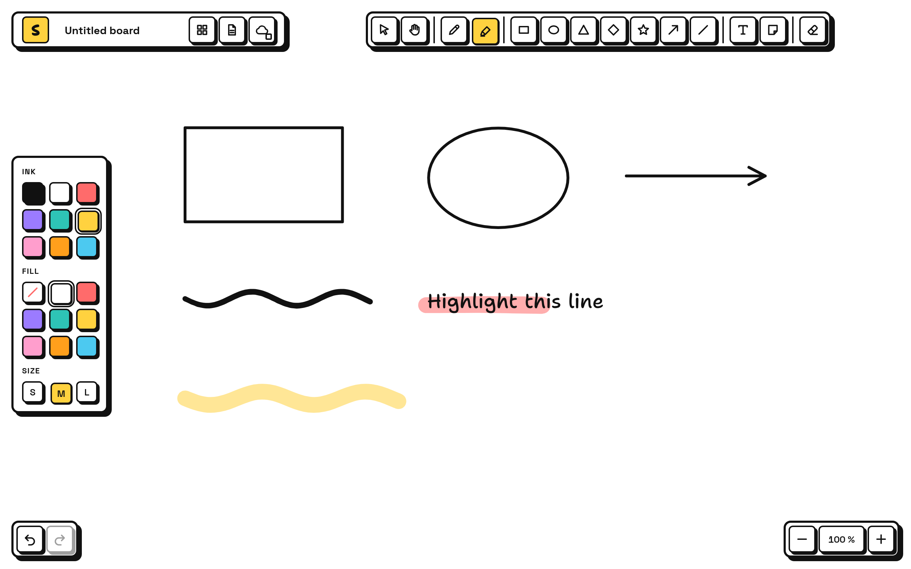

# Scratchii

A scratchpad for notes and sketches on a clean white surface, where everything looks drawn by hand and styled in
Neo Brutalism: thick black outlines, flat bright colours, hard shadows and handwritten text. It runs in the browser
and as a desktop app on Linux. Written in TypeScript, with a small Tauri shell for the desktop.

Boards stay on your machine. Sync goes only to a server you run yourself. The interface is in English; German can
be chosen in the settings.

<p align="center">
  
  
</p>

## Features

- A pen that follows pen pressure and feels like a felt marker
- Boxes, ellipses, triangles, diamonds, stars, lines, arrows, text, sticky notes and pictures
- Hold the pen still at the end of a scribble and it becomes a clean box, circle or ellipse, triangle, diamond,
  star, line or arrow; nearly round, square or level shapes snap to round, square and level
- Type `=` after maths in a text or note and the answer appears: sums with powers, roots and functions,
  `0x`/`0b` numbers, `255 in hex`, and IPv4 subnets (`192.168.1.0/26 =`)
- Drag the marker over text to highlight that part of the line; the highlight moves with the text
- Right-click a text to underline it with one of eight hand-drawn styles, or draw your own
- Handwriting to typed text, offline (experimental)
- A library of all boards with search over titles, tags and text, and thumbnails
- Open and save `.scratchii` files, export as PNG, SVG or PDF
- Sync between the desktop app and browsers through your own small server, edit by edit, without losing changes
- Undo for everything, keyboard shortcuts, a dot grid if you want one

Status: drawing, shapes, marks, files, export, library and sync are tested with property tests and in a headless
browser; the desktop app was run on Linux (Arch). Shape snapping and handwriting recognition are measured only on
generated strokes, not yet on real handwriting, see [docs/verification.md](docs/verification.md). The app icon is
a placeholder.

<p align="center">
  
</p>

## Run it in the browser

Needs Node.js 24 or newer.

```sh
git clone https://github.com/mikaeww/scratchii.git
cd scratchii
npm install
npm run dev
```

Then open http://localhost:5174. Boards are kept in the browser's storage.

## Install the desktop app

Needs Node.js 24 or newer, Rust and WebKitGTK 4.1. On Arch Linux:

```sh
sudo pacman -S --needed base-devel nodejs npm rust webkit2gtk-4.1
git clone https://github.com/mikaeww/scratchii.git
cd scratchii
./install.sh
```

`install.sh` builds the app and puts the `scratchii` command, the menu entry and the icon into `~/.local`; no root
needed. `./install.sh --uninstall` removes them again and keeps your boards. `npm run desktop:build` makes a `.deb`
and an AppImage under `src-tauri/target/release/bundle/` instead.

## Sync between devices

Run the server on any machine your devices can reach. It needs only Node.js and serves the app as well:

```sh
npm install
npm run build
SCRATCHII_TOKEN="a long secret of your own" SCRATCHII_HOST=0.0.0.0 npm run server
```

On every device open Settings (the cloud button, top left), enter the server address, for example
`http://192.168.1.10:8787`, and the same token. Boards sync every few seconds; the dot on the cloud button shows the
state. The server keeps its data in `~/.local/share/scratchii-server/boards.db`; `SCRATCHII_PORT` and
`SCRATCHII_DATA` change port and place. Use it in your own network or behind HTTPS, the token travels with every
request.

## Shortcuts

| Key | Action |
| --- | --- |
| V, H, P, M | select, hand, pen, marker |
| R, O, 3, D, S | box, ellipse, triangle, diamond, star |
| A, L | arrow, line |
| T, N, E | text, sticky note, eraser |
| Space (hold) | move the canvas |
| Ctrl+Z / Ctrl+Shift+Z | undo / redo |
| Ctrl+C / X / V, Ctrl+D | copy, cut, paste, duplicate |
| Ctrl+A, Delete | select all, delete |
| ] / [ | bring to front / send to back |
| Arrow keys | nudge the selection (with Shift: 10 steps) |
| Right-click | underline, highlight, convert handwriting |

## Check

```sh
npm run check                       # format, lint, types, structure limits, tests, Rust format and lint
node tools/render.ts out.png board  # headless screenshot; scenes are listed in the file
node tools/ocr-check.ts             # measures handwriting recognition on 20 drawn words
```

The screenshots above are `tools/render.ts` output with its made-up sample data. The app is in `src/`, the sync
server in `server/`, the desktop shell in `src-tauri/`. Conventions, decisions and verification plans are in
[docs/](docs/README.md).

## License

MIT. The bundled fonts Shantell Sans and Space Grotesk are under the SIL Open Font License, see `public/fonts/`.
